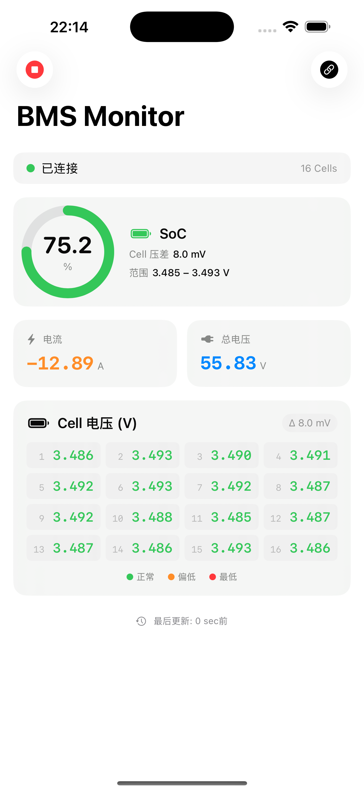
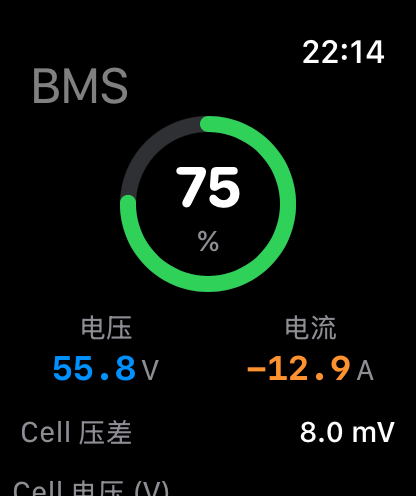
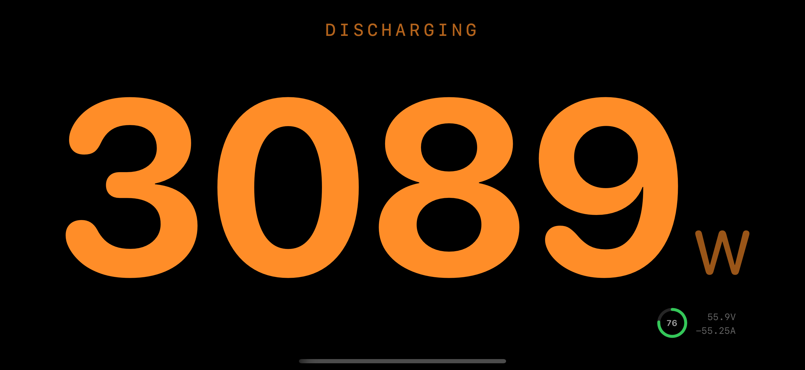
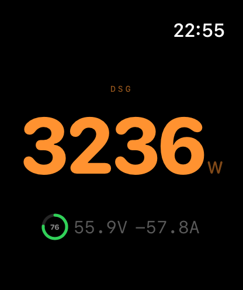

# BMSTracker

A Battery Management System (BMS) monitor for iOS and watchOS. Displays real-time battery data received from a BMS device via Bluetooth Low Energy (BLE).

[中文版](#中文)

## Screenshots

<p align="center">
  
  &nbsp;&nbsp;&nbsp;&nbsp;
  
</p>

<p align="center">
  
  &nbsp;&nbsp;&nbsp;&nbsp;
  
</p>

## Features

- **Real-time BMS Data** — Current, State of Charge (SoC), total voltage
- **Cell Voltage Grid** — Up to 24 individual cell voltages with color-coded health indicators (green/orange/red)
- **Cell Voltage Delta** — Displays the difference between the highest and lowest cell voltages
- **SoC Ring Chart** — Visual circular gauge with color coding
- **BLE Communication** — Connects to BMS hardware via Bluetooth Low Energy
- **Apple Watch App** — Companion watchOS app showing SoC, voltage, current, and cell voltages
- **iOS → Watch Sync** — Automatic data push via WatchConnectivity (applicationContext, sendMessage, transferUserInfo)
- **Power Gauge (iPhone)** — Rotate to landscape for a full-screen real-time power display (W) with mini SoC ring
- **Power Gauge (Watch)** — Long press to toggle a full-screen power gauge view
- **Offline Cache** — Last known data persisted to UserDefaults, available on next launch
- **Simulator Mode** — Built-in data simulator for development and testing

## Architecture

```
BMSTracker/
├── BMSTrackerApp.swift              # App entry point
├── ContentView.swift                # Main iOS dashboard
├── Shared/
│   ├── BMSData.swift                # Data model (shared with watchOS)
│   └── WatchPayload.swift           # iOS ↔ Watch encoding/decoding
├── Services/
│   ├── BLEManager.swift             # CoreBluetooth BLE communication
│   ├── BMSDataStore.swift           # Observable cache layer
│   ├── BMSSimulator.swift           # Mock data generator
│   └── WatchSessionManager.swift    # WCSession (iOS sender)
└── Views/
    └── CellVoltageGridView.swift    # Cell voltage grid component

BMSTrackerWatchKit Watch App/
├── BMSTrackerWatchKitApp.swift      # Watch app entry point
├── ContentView.swift                # Watch dashboard
├── Shared/                          # Same shared files
└── Services/
    └── WatchDataReceiver.swift      # WCSession (Watch receiver)
```

## Data Flow

```
BMS Hardware ──BLE──► BLEManager ──► BMSDataStore ──► iOS UI
                                          │
                                          ├──► UserDefaults (cache)
                                          │
                                          └──► WatchSessionManager ──WCSession──► WatchDataReceiver ──► Watch UI
```

## Requirements

- iOS 18.0+
- watchOS 11.0+
- Xcode 26.0+
- Swift 5.0+

## Getting Started

1. Clone the repository
   ```bash
   git clone git@github.com:chinawrj/BMSTracker.git
   ```
2. Open `BMSTracker.xcodeproj` in Xcode
3. Select a target device and run
4. Use the **▶ play button** (top-left) to start the built-in simulator for testing without real BMS hardware

## BLE Integration

To connect to your actual BMS device, update the following in `BLEManager.swift`:

1. **Service UUID** and **Characteristic UUID** — replace with your BMS device's UUIDs
2. **`parseBMSData(_:)`** — implement the parsing logic according to your BMS protocol

## License

MIT

---

<a name="中文"></a>
# BMSTracker 中文说明

电池管理系统（BMS）监控应用，支持 iOS 和 watchOS。通过蓝牙低功耗（BLE）接收 BMS 设备的实时电池数据。

## 截图

<p align="center">
  
  &nbsp;&nbsp;&nbsp;&nbsp;
  
</p>

<p align="center">
  
  &nbsp;&nbsp;&nbsp;&nbsp;
  
</p>

## 功能

- **实时 BMS 数据** — 电流、电量百分比（SoC）、总电压
- **Cell 电压网格** — 最多 24 个独立 Cell 电压，颜色编码健康状态（绿/橙/红）
- **Cell 压差显示** — 显示最高与最低 Cell 电压的差值
- **SoC 环形图** — 带颜色编码的环形进度图
- **BLE 通信** — 通过蓝牙低功耗连接 BMS 硬件
- **Apple Watch 应用** — watchOS 伴侣应用，显示 SoC、电压、电流和 Cell 电压
- **iOS → Watch 同步** — 通过 WatchConnectivity 自动推送数据
- **功率大屏（iPhone）** — 横屏自动切换全屏实时功率显示（W），带迷你 SoC 圆环
- **功率大屏（Watch）** — 长按切换全屏功率仪表视图
- **离线缓存** — 上次数据持久化到 UserDefaults，下次启动时可用
- **模拟器模式** — 内置数据模拟器，方便开发和测试

## 系统要求

- iOS 18.0+
- watchOS 11.0+
- Xcode 26.0+
- Swift 5.0+

## 快速开始

1. 克隆仓库
   ```bash
   git clone git@github.com:chinawrj/BMSTracker.git
   ```
2. 用 Xcode 打开 `BMSTracker.xcodeproj`
3. 选择目标设备并运行
4. 点击左上角 **▶ 播放按钮** 启动内置模拟器，无需真实 BMS 硬件即可测试

## BLE 对接

要连接你的 BMS 设备，修改 `BLEManager.swift` 中的：

1. **Service UUID** 和 **Characteristic UUID** — 替换为你 BMS 设备的 UUID
2. **`parseBMSData(_:)`** — 根据你的 BMS 协议实现解析逻辑
